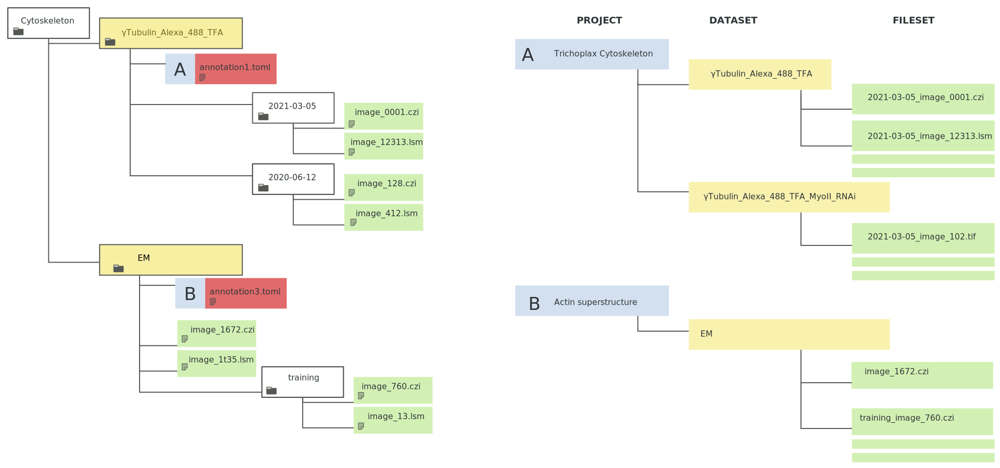

# Automatic importer for omero

This project is meant works in conjunction with [cataloger](https://github.com/centuri-engineering/cataloger) to automate image import and annotation in an [omero](https://openmicroscopy.org/omero) database.

## Installation

Depending on your import scenario, you might need to install this package on the omero server instance directly. If you use docker, look at the adapted [Dockerfile](Dockerfile) in this repository.

Else, for now, please install from source.

```sh
python -m pip install -r requirements.txt
python -m pip install -e .
```

In any case you need full admin privileges on the omero server to run this tool.

How to setup this project as a service is not yet implemented.


## Workflow


We use [watchdog](https://pythonhosted.org/watchdog/) to monitor the directory from which to import the data.

Initially, we monitor only for `.toml` card (see [cataloger](https://github.com/centuri-engineering/cataloger)) When such card appears in the file-system, all microscopy data below is imported and annotated according to this card's content.

If a `toml` file is modified, but the data in its base directory was already imported, the annotations are updated.


### Not Implemented (yet)

After a directory has been imported once, a new observer should be created to monitor this directory for new image files. If files are added to that directory, they will be imported and annotated.

### Caveats

> I'm sure there are tons of corner cases I haven't though about, proceed with caution


## Mapping between file structure and omero database:

The user and project are defined in the toml file (see below).
The dataset is set as the parent directory of the toml file. If there is already a dataset with the same name in the project, a new dataset is still created, and it is left to the user to lift the ambiguity in the web client. Image names in the db are concatenated from the path to the image relative to the base directory.



I'm opened to suggestions on better ways to solve this non-bijective issue.


## Minimal  toml file:

```toml
# omero annotation file
project = "The project name"
user = "a-valid-omero-user"
```


## Environment variables

You have to define the following variables (here with their defaults)

```sh
OMERO_SERVER=localhost
OMERO_PORT=4064
OMERO_ROOT_PASSWORD
```
